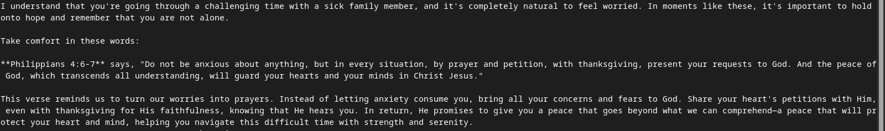

agents are llm + tools
store the conversation state in redis

A circular import in Python occurs when two or more modules depend on each other, creating a loop that prevents them from being fully loaded. This situation often leads to errors, such as ImportError, because Python cannot resolve the dependencies correctly.

